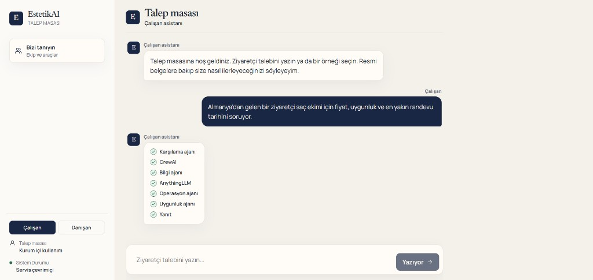
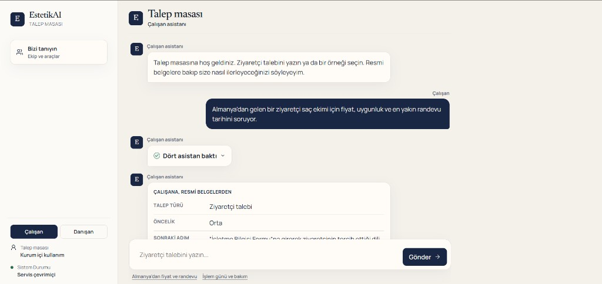
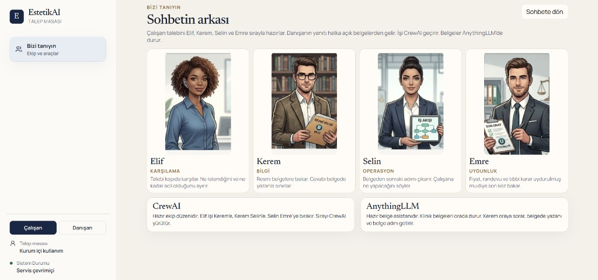
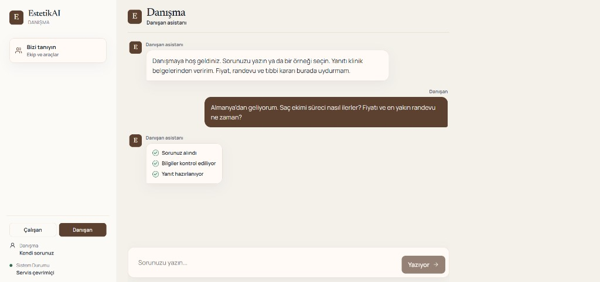
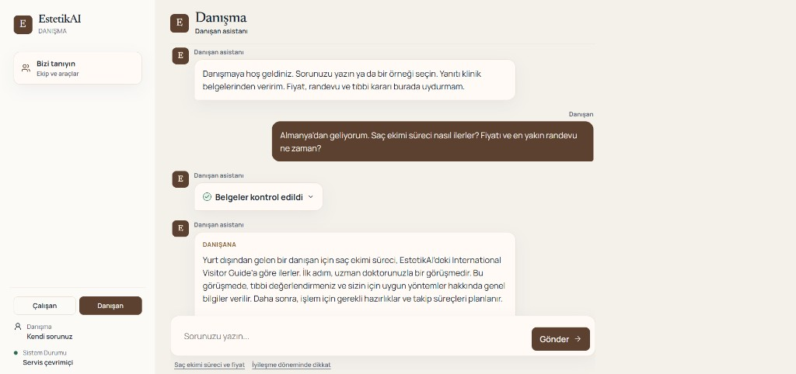

# EstetikAI

Bu çalışma, bir estetik cerrahi kliniği için hazırlanmış örnek vakadır. Klinik belgelerini yerinde tutar. Çalışan ve danışan, bu belgelere göre cevap alır.

Bu projede RAG mimarisi kullanıldı. Cevap, modelin ezberinden değil, kliniğin kendi belgelerinde aranıp bulunan parçalardan üretilir. Bu aramayı AnythingLLM yapar.

Sitede iki kapı vardır. **Çalışan** klinik personeli içindir. **Danışan** kliniğe yazan kişidir. Soldaki **Bizi tanıyın** ekranı, sohbetin arkasındaki ekibi ve kullanılan araçları gösterir.

Fiyat, randevu tarihi ve tıbbi uygunluk belgede yoksa uydurulmaz. O kısım bir yetkiliye bırakılır.

## Dışarıdan bağlanan araçlar

AnythingLLM ve CrewAI bu projenin içinde yazılmadı. İkisi de hazır araçlardır. EstetikAI onlara bağlanır ve kullanır.

- **AnythingLLM** bilgisayarda ayrı çalışan belge asistanıdır. Klinik belgeleri orada durur. Bu proje oraya soru gönderir, cevabı ve belge adını alır. Belgeler bu klasöre kopyalanmaz.
- **CrewAI** hazır ekip düzenidir. Karşılama, bilgi, operasyon ve uygunluk asistanlarının işi ve sırası bu projede tanımlanır. İşi elden ele geçiren CrewAI’dır.

## Klinikte kim ne görür

**Çalışan** ziyaretçi talebini yazar. Sistem resmi iç belgelere bakar ve çalışana kaydı nasıl ilerleteceğini söyler. Dört asistan sırayla bakar:

1. Elif, karşılama. Talebin türünü ve ne kadar acil olduğunu ayırır.
2. Kerem, bilgi. Resmi belgelerde ne yazdığına bakar.
3. Selin, operasyon. Çalışanın sonraki adımını yazar.
4. Emre, uygunluk. Cevapta belgede olmayan fiyat, randevu veya tıbbi karar var mı diye son kez bakar.

Bu soru biraz uzun sürer, çünkü asistanlar sırayla çalışır.

**Danışan** soruyu kendi ağzından yazar. Cevap, kliniğin danışana gösterdiği kendi belgelerinden gelir. Bunlar da şirketin belgeleridir; yalnızca iç kayıtlar değil, müşteriye anlatılan bilgilerdir. İç kayıt adımları ve belge adları danışana gösterilmez. Danışan tarafında bu dört kişi sırayla çalışmaz.

## Teknik kazanımlar

Bu projede RAG mimarisi kullanıldı. RAG, cevabı modelin aklından değil, önce belgelerde arayıp bulunan parçalardan üretmektir. Aramayı ve belgeye dayalı cevabı AnythingLLM yapar. EstetikAI bu hazır RAG katmanına bağlanır. Vektör veritabanı bu klasörün içinde ayrıca yazılmadı.

- **İki ayrı bilgi alanı.** Çalışan iç belgelere, danışan ise kliniğin müşteriye gösterdiği belgelere sorar. İki cevap birbirine karışmaz.
- **Her soru yeni arama.** Soru her seferinde belgelerin içinden yeniden çekilir. Eski sohbet, belge adını düşürmez.
- **Çalışan tarafında ekip sırası.** CrewAI ile dört asistan sırayla çalışır: talebi ayırma, belgeden bilgi alma, sonraki adım, son kontrol.
- **Uydurma yok.** Fiyat, randevu ve tıbbi uygunluk belgede yoksa cevap bunları sayı, tarih veya “uygun” diye yazmaz. O kısım bir yetkiliye kalır.
- **Anahtarlar ekrana çıkmaz.** Tarayıcı yalnızca EstetikAI arka tarafına konuşur. Dil modeli ve AnythingLLM anahtarları `.env` dosyasında kalır.

## Kurulum

Bilgisayarda Python 3.13 ve Node.js hazır olsun. AnythingLLM Desktop açık olsun. İçinde iki çalışma alanı bulunsun: çalışan belgeleri ve danışan belgeleri.

Proje klasöründe PowerShell açın:

```powershell
py -3.13 -m venv .venv
.venv\Scripts\Activate.ps1
python -m pip install -r requirements.txt
copy .env.example .env
```

`.env` dosyasına iki anahtar yazılır: dil modeli anahtarı ve AnythingLLM anahtarı. Anahtarlar bu dosyada kalır. Ekranda ve kodda görünmez.

Site için bir kez:

```powershell
cd frontend
npm install
```

## Çalıştırma

AnythingLLM açık kalsın. Sonra iki ayrı pencere açın.

Birinci pencere, proje klasörü. Bu pencere arka tarafı ayağa kaldırır:

```powershell
.venv\Scripts\python.exe -m uvicorn backend.api:app --host 127.0.0.1 --port 8000
```

İkinci pencere siteyi açar:

```powershell
cd frontend
npm run dev
```

İkinci pencerenin yazdığı adresi tarayıcıda açın. Adres çoğunlukla `http://127.0.0.1:5173` olur. O kapı doluysa bir sonraki kapı yazılır, örneğin `5174`.

İsterseniz aynı talebi terminalden de deneyebilirsiniz. Bu yol yalnızca çalışan akışıdır:

```powershell
.venv\Scripts\python.exe backend\main.py
```

`Ziyaretçi talebini girin:` satırına metni yazıp Enter’a basın.

## Kullanıcı senaryoları

Yazma kutusunun altında hazır örnekler de vardır. Sunumda aşağıdaki metinleri olduğu gibi yapıştırabilirsiniz.

### Çalışan — fiyat ve randevu

**Çalışan**’ı seçin ve şunu yapıştırın:

```text
Almanya'dan gelen bir ziyaretçi saç ekimi için fiyat, uygunluk ve en yakın randevu tarihini soruyor.
```

Cevap çalışana gelir. Resmi belgelerden kaydı nasıl açacağını söyler. Fiyat, randevu ve tıbbi uygunluk için sayı, tarih veya “uygun” kararı yazmaz. O kısım insan onayına gider.

### Çalışan — işlem günü ve bakım

**Çalışan**’ı seçin ve şunu yapıştırın:

```text
Hollanda'dan gelen bir ziyaretçi saç ekimi işlem gününün nasıl geçeceğini ve sonrası bakımı soruyor.
```

Cevap yine çalışana gelir. İşlem günü ve bakım, resmi belgelerde yazanla sınırlı kalır.

### Danışan — süreç ve fiyat

**Danışan**’ı seçin ve şunu yapıştırın:

```text
Almanya'dan geliyorum. Saç ekimi süreci nasıl ilerler? Fiyatı ve en yakın randevu ne zaman?
```

Cevap müşteriye gelir. Süreç klinik belgelerinden, sade Türkçe anlatılır. İç ekip adımları görünmez. Fiyat ve randevu belgede yoksa uydurulmaz. Bir yetkilinin söyleyeceği belirtilir.

### Danışan — iyileşme

**Danışan**’ı seçin ve şunu yapıştırın:

```text
Saç ekimi sonrası ilk günlerde nelere dikkat etmeliyim?
```

Cevap müşteriye gelir. İlk günlerde dikkat edilecekler, kliniğin kendi danışan belgelerinde yazanla sınırlı kalır.

## Ekran görüntüleri

### Çalışan talebi hazırlanıyor

Çalışan talebi yazdıktan sonra asistanlar sırayla bakar. Bu sırada düğmede “Yazıyor” yazar.



### Çalışana gelen yanıt

Yanıt çalışana, resmi belgelerden gelir. Talep türü, öncelik ve sonraki adım ayrı satırlarda durur. “Dört asistan baktı” satırı, bakan ekibi toplu gösterir.



### Bizi tanıyın

Sohbetin arkasındaki dört kişi, CrewAI ve AnythingLLM bu ekranda anlatılır. Aynı ekran danışan tarafında da açılır.



### Danışan sorusu hazırlanıyor

Danışan kendi sorusunu yazar. Cevap, kliniğin danışana gösterdiği kendi belgelerinden hazırlanır.



### Danışana gelen yanıt

Yanıt müşteriye konuşur. İç ekip adımları bu yazıda görünmez.


